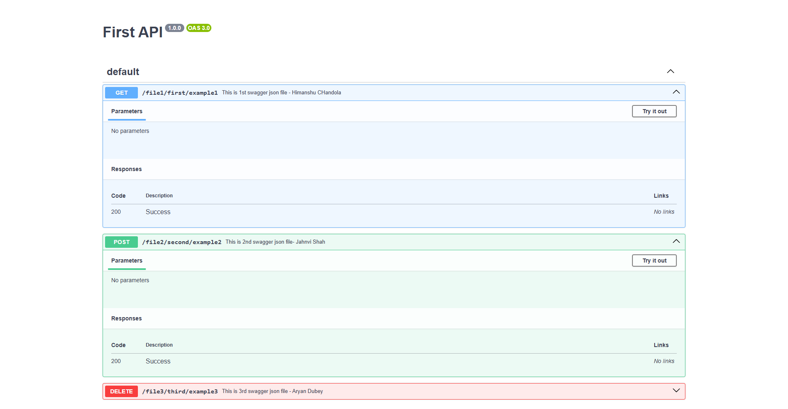

# Swagger JSON Merger Application

This is a **React.js** application designed to merge multiple Swagger JSON files into a single Swagger UI interface.

## Purpose
This application demonstrates how multiple Swagger JSON files can be merged dynamically into one interface. The main goal is to support scenarios where Swagger JSON files come from different servers or sources. Whenever the JSON content changes in any of the individual Swagger files, the changes are automatically reflected in the merged interface.

## Features
- **Local Testing**: The application currently supports merging local Swagger JSON files located in the `public/swagger` folder.
- **Dynamic Updates**: In real-world scenarios, JSON files from remote servers can be dynamically merged into the interface.
- **Single UI**: Combines multiple Swagger JSON files into a single, user-friendly Swagger UI.

## How It Works
1. Swagger JSON files are placed in the `public/swagger` folder.
2. The application fetches all the files and merges their contents using the `openapi-merge` library.
3. The merged result is displayed in a single Swagger UI.

## Folder Structure
```
swagger-test/
├── public/
│   ├── swagger/
│   │   ├── swagger1.json
│   │   ├── swagger2.json
│   │   ├── swagger3.json
│   ├── ...
├── src/
│   ├── components/
│   │   ├── SwaggerDemo.js
│   ├── utility/
│   │   ├── constant.js
│   ├── ...
├── README.md
```

## How to Run
1. Clone the repository.
2. Install dependencies using `npm install` or `pnpm install`.
3. Start the application with `npm start` or `pnpm start`.
4. Open your browser and navigate to `http://localhost:3000` to view the merged Swagger UI.

## Demo

Below is an example of how the merged Swagger UI will look: https://swagger-reactjs.vercel.app




## Future Enhancements
- Add support for fetching Swagger JSON files from remote servers.
- Improve error handling and loading states.
- Provide configuration options for different merging strategies.

---

Happy coding!
